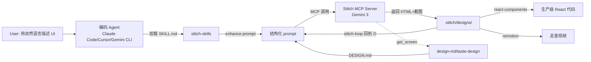

# 深度调研：Stitch Agent Skills（google-labs-code/stitch-skills）

> 上游来源：<https://github.com/google-labs-code/stitch-skills>
>
> 调研时间：2026-04-19
>
> 说明：本文档是对上游 `stitch-skills` 仓库的中文深度调研记录，随 fork 一起保留作参考。

## 基本信息

| 项目 | 详情 |
|------|------|
| 发布方 | Google Labs（非官方正式产品，社区/实验性质） |
| 创建时间 | 2026-01-16（约 3 个月前） |
| 最近推送 | 2026-03-27 |
| Stars / Forks | **4,572** / 536（启动仅 3 个月，增速极快） |
| 主语言 | TypeScript |
| 协议 | Apache 2.0 |
| 前置条件 | Stitch MCP Server + 支持 Agent Skills 的编码 agent（Antigravity / Gemini CLI / Claude Code / Cursor） |
| 安装方式 | `npx skills add google-labs-code/stitch-skills --skill <name> --global` |

## 这是什么

**stitch-skills 是 Google Labs 为其 AI UI 设计工具 [Stitch](https://labs.google.com/stitch) 配套发布的一套"Agent 技能库"。** Stitch 本身由 Gemini 2.5 Pro / Gemini 3 驱动，在 Google I/O 2025 亮相，可通过自然语言或图片生成 Web/Mobile 的高保真 UI，并导出 HTML/CSS 或 Figma。本仓库不是 Stitch 产品本体，而是把"如何正确调用 Stitch MCP、如何把 Stitch 输出接入真实工程"的知识打包成**可被任意编码 agent 加载的 SKILL.md 文件**，遵循 **Agent Skills 开放标准**（与 Anthropic 推广的 skill 格式兼容）。

目标用户：用 Claude Code / Cursor / Gemini CLI / Google 自家 Antigravity IDE 做前端工作，又想把 Stitch 生成的设计自动落地到代码、视频、甚至多页网站的开发者。

## 核心功能（8 个 skill）

README 列了 7 个，实际仓库含 8 个（`taste-design` 是 2026-03-30 新加的，README 未更新）。

| Skill | 作用 | 关键产出 |
|---|---|---|
| **stitch-design** | 2026-03-11 引入的**统一入口**，合并旧版 `design-md` + `enhance-prompt` 能力 | 增强 prompt → 生成/编辑屏幕 → 写 `.stitch/DESIGN.md` |
| **stitch-loop** | "接力棒"（baton）模式的**自治多页网站生成**循环 | `.stitch/next-prompt.md` 作为 relay，每轮生成一页并写下一轮任务 |
| **design-md** | 逆向分析已有 Stitch 项目，提炼"语义化设计系统" | `DESIGN.md`（颜色语义名 + hex + 功能角色） |
| **enhance-prompt** | 把"做个登录页"这类粗糙 prompt 结构化为 Stitch 友好格式 | 强化后 prompt（平台 / 主题 / 页面结构分节） |
| **react-components** | Stitch HTML → 模块化 React 组件 + AST 校验 | `src/components/**`、`mockData.ts`、`tailwind` 同步 |
| **remotion** | Stitch 截图 → Remotion 走查视频（转场 / 缩放 / 文字叠加） | 基于 React 的视频合成工程 |
| **shadcn-ui** | shadcn/ui 组件发现、安装、主题与 `cn()` 最佳实践 | 直接对接 `npx shadcn@latest add` |
| **taste-design** ⭐ | **反 AI-slop** 的严苛设计系统生成器 | 禁用 Inter、纯黑、紫色霓虹、3 等宽卡片、虚构数据等 |

## 架构 / 原理分析



**核心设计范式**：

1. **Skill-as-folder**：每个 skill 都是目录，包含 `SKILL.md`（对 agent 的指令）+ `scripts/`（可执行脚本，如重定向健壮的 `fetch-stitch.sh`）+ `resources/`（知识库，如 `style-guide.json`、`component-template.tsx`、`architecture-checklist.md`）+ `examples/`（few-shot 参考）。
2. **MCP 优先**：所有 skill 通过 `list_tools` 动态发现 Stitch MCP 前缀（避免硬编码 `stitch:` vs `mcp_stitch:`），再调用 `list_projects`、`get_screen`、`generate_screen_from_text`、`edit_screens` 等工具。
3. **Baton 循环（stitch-loop）**：通过 `.stitch/next-prompt.md` 文件把下一轮任务写进去，让 agent **自发重入**——这是把多步任务编码到文件系统中的经典 "cooperative autonomy" 模式。
4. **文件约定层**：所有 skill 共享 `.stitch/{metadata.json, DESIGN.md, SITE.md, designs/}` 的目录契约，使跨 skill 协作成为可能。

## 关键技术细节

1. **两条 DESIGN.md 路线分叉**：官方 `design-md`（从已有设计**反向**提取）vs 社区贡献的 `taste-design`（**正向强约束**，内置一套极端反模板规则）。后者是仓库中设计感最强的 skill：明文禁用 Inter 字体、纯黑 `#000000`、紫色霓虹、`Times/Georgia` 等衬线字体、"SCROLL TO EXPLORE" 等填充文字、3 等宽卡片、虚构 "99.98% UPTIME" 假指标；强制 Spring 物理动画、`clamp()` 字号、44px 触点。
2. **高可靠下载脚本**：`scripts/fetch-stitch.sh` 专门处理 Google Cloud Storage 的重定向与签名握手——注释直接点明 "Internal AI fetch tools can fail on GCS domains"，这是把工程经验封装到 skill 的典型例子。
3. **React 输出的强约束**：模板要求每个组件必须有 `Readonly<[Name]Props>` 接口、事件处理函数拆到 `src/hooks/`、静态内容拆到 `src/data/mockData.ts`、Tailwind 值对齐 `style-guide.json`、用 `npm run validate` 做 AST 级检查——本质是**把"好前端代码"的定义固化到 skill**。
4. **跨 MCP 组合**：`stitch-loop` 在可选的 Chrome DevTools MCP 可用时，自动启本地 dev server → 截图 → 与 Stitch 原图做视觉比对——这是**多 MCP 协同**的早期范例。
5. **Agent 生态适配**：通过 `npx skills` CLI 自动识别本机是否装了 Antigravity / Gemini CLI / Claude Code / Cursor，并把 skill 放到对应位置（`~/.claude/skills`、`~/.gemini/skills` 等），回避多 agent 分裂的问题。

## 战略意义分析

### 为什么值得关注

1. **Google 在 Agent Skills 开放标准上的站队**。过去 "skill" 基本是 Anthropic / Claude Code 生态的术语；Google 用自己的旗舰实验性产品（Stitch）反向喂料开放 skill 格式，等于承认这是未来编码 agent 的事实标准。作为对比，Google 自家还在主推 Antigravity（Gemini 3 IDE），但 skill 是跨 agent 的。
2. **"设计→代码"链条的 AI 原生化**。Figma 时代流程是"设计师在 Figma 画 → 工程师抄"，stitch-skills 尝试的链条是"自然语言 → Stitch AI → Skill 驱动的 Agent 直接接入真实工程"，中间不需要人工翻译。
3. **"风格/品味"被编码为 skill**。`taste-design` 把 Pieter Levels / Rauno 那套"反 AI 大路货"的经验做成了**可复用的硬约束**——这是把"设计品味"变成可版本化资产的罕见尝试。
4. **生态增速信号**：3 个月 4.5k star，在非 Anthropic 自家的 skill 仓库里属顶级。

### 对相关方的影响

| 相关方 | 影响 |
|---|---|
| **独立开发者 / Solo Maker** | `stitch-loop` + `taste-design` 组合接近 "一句话造个品质合格的多页站"；传统 Figma → React 流程可能被绕开 |
| **前端工程师** | 最值得关注的是 `react-components` 的 AST 校验范式——可以借鉴到自己团队的组件规范落地 |
| **设计系统团队** | `design-md` / `taste-design` 展示了一种"**语义化 DESIGN.md**"写法：用 "Deep Muted Teal-Navy (#294056) for primary actions" 而非 Tailwind token，让 AI 和人都能读 |
| **Claude Code / Cursor 用户** | 即便不用 Stitch，`shadcn-ui` skill 和 `taste-design` 的反模板规则可以单独拿来用 |
| **中国开发者** | `labs.google.com/stitch` 在国内需自备代理；skill 本身没有地域限制，但 Stitch MCP 连通性可能是最大阻碍 |

## 实际价值评估

| 场景 | 价值 | 推荐度 |
|---|---|---|
| 用 Claude Code / Cursor 快速做 landing page / 个人项目 | 极高——`stitch-loop` + `taste-design` 可以一键出风格在线的多页网站 | 高 |
| 企业级前端工程（已有设计系统） | 中等——`react-components` 的 AST 约束值得借鉴，但直接使用需改写规则对齐内部规范 | 中 |
| 从 Stitch 产物做走查 demo / 投融资视频 | 高——`remotion` skill 是仓库里最被低估的实用功能 | 高 |
| 设计师工作流替代 Figma | 中低——Stitch 更像"概念生成器"，复杂交互、多态组件、协作能力远不如 Figma | 中 |
| 学习"如何写一个好 skill" | 很高——目录规范、MCP 前缀动态发现、baton 模式都是教科书级范例 | 高 |

## 局限性

1. **非官方支持**。README 末尾明写 "This is not an officially supported Google product"，不列入 Google OSS 漏洞奖励计划。SLA、长期维护预期都弱。
2. **强耦合 Stitch MCP**。除 `shadcn-ui` 和 `taste-design`（文档意义更大）外，7 个 skill 里 6 个必须有 Stitch MCP Server 才能跑。Stitch 本身是实验性工具，域名从 `stitch.withgoogle.com` 换到 `labs.google.com/stitch` 都还在调整。
3. **README 与仓库不同步**。`taste-design` 这个最有品味的 skill 根本没在 README 里出现；`stitch-design` 已经替代 `design-md` + `enhance-prompt`，但旧两个还在——使用前需读 SKILL.md 判断哪个是"当前主线"。
4. **`react-components` 定死 Vite + Tailwind + TypeScript**。Next.js、CSS Modules、styled-components 项目需要自己改 template。
5. **`taste-design` 过于 opinionated**。禁 Inter、禁纯黑、强制 Spring 动画——品味很强但也意味着它会覆盖很多真实项目的既定规范；适合从 0 开始的 side project，不适合接入已有品牌系统。
6. **多 MCP 编排仍很脆弱**。`list_tools` 动态发现前缀的兜底不错，但一旦 Stitch API 契约变化，所有 skill 都要跟着改。

## 一句话总结

**stitch-skills 是 Google Labs 用 Stitch 做"鱼饵"、实际在推进"Agent Skills 作为跨 agent 标准"的作品**——它既是 Stitch 的工程落地工具箱，也是一套关于"如何把设计品味、代码规范、自治循环都编码进 SKILL.md"的高质量范例集。

## 可复用启发（针对 fork 的使用建议）

即便不接 Stitch MCP，也可以从本仓库抽走这两份资产独立使用：

- `skills/taste-design/SKILL.md` —— 反 AI-slop 规则清单，可以直接塞到自己的 Claude Code / Cursor skill 里，作为"生成前端时的品味护栏"。
- `skills/react-components/resources/architecture-checklist.md` + `scripts/validate*` —— AST 级组件规范校验的范式，可移植到任何 React 团队的代码评审流。

如需进一步追踪上游变更：

```bash
git remote -v              # 检查 upstream 是否已配置（clone 时已自动添加）
git fetch upstream
git log upstream/main --oneline -20
```
